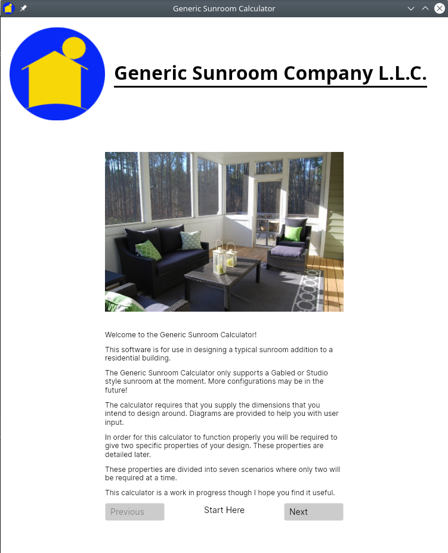
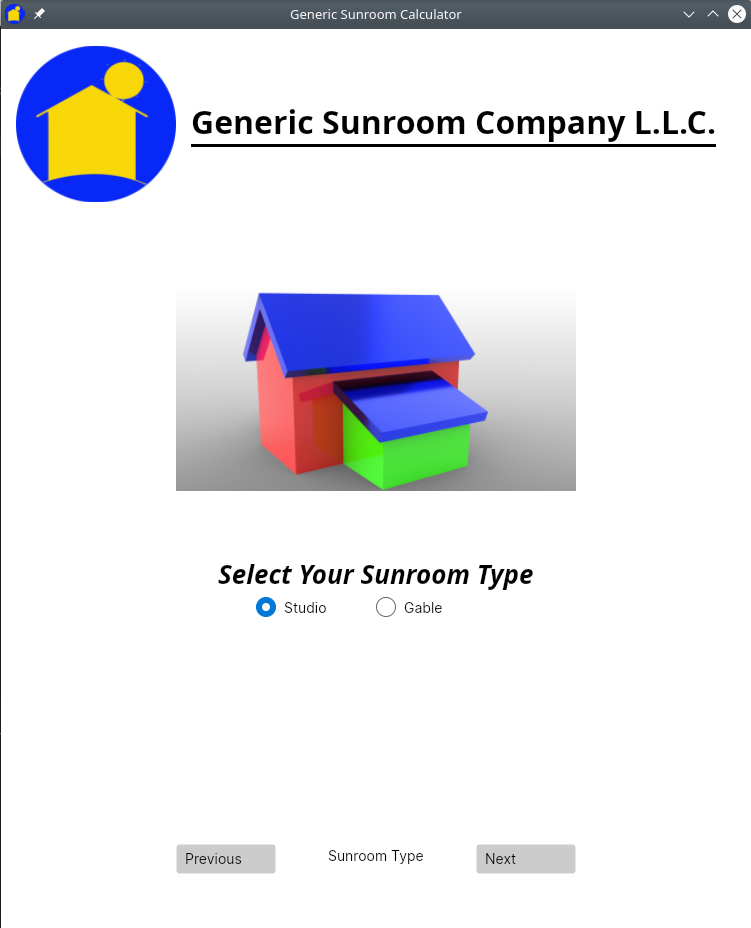
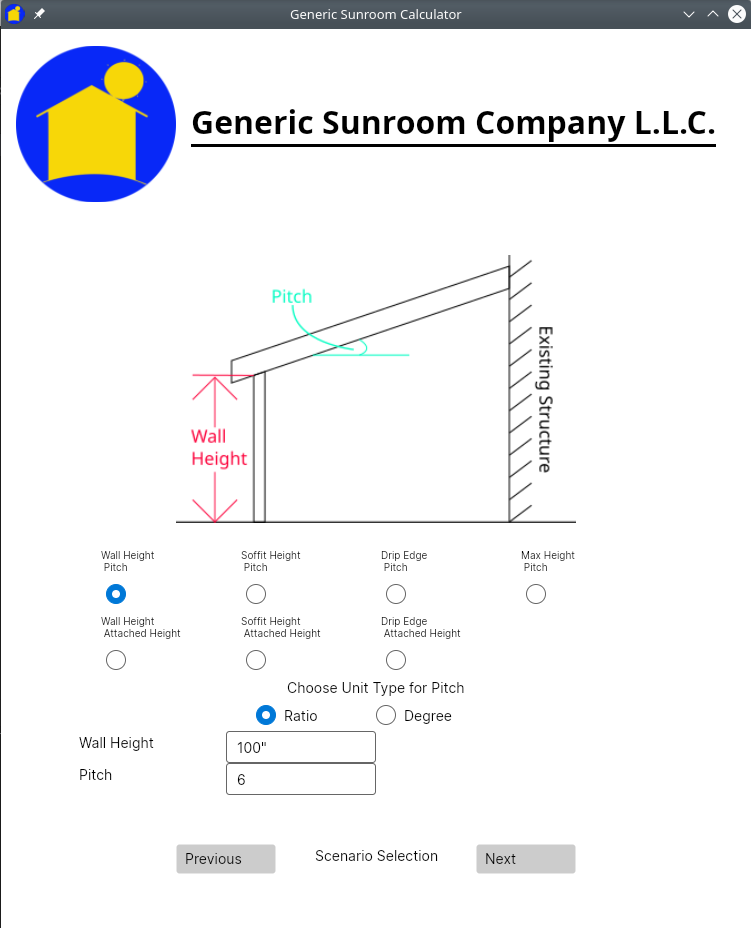
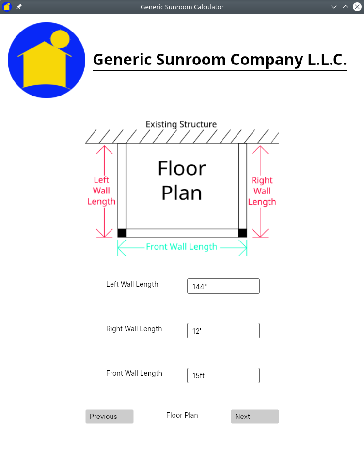
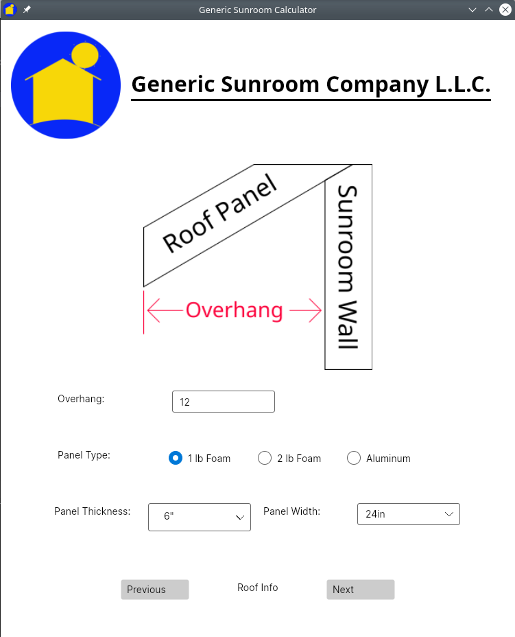
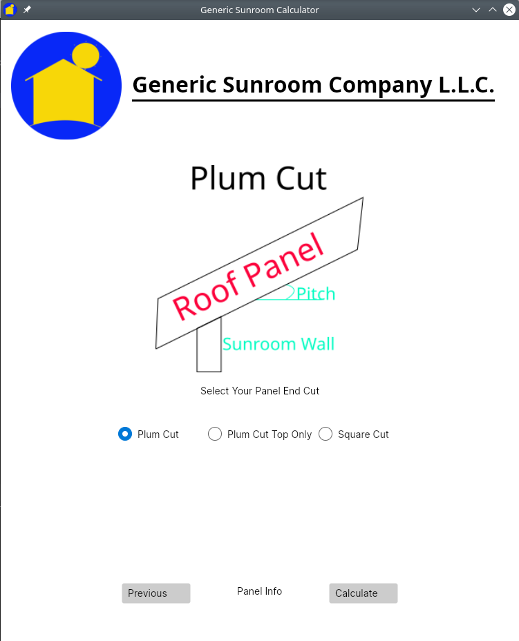
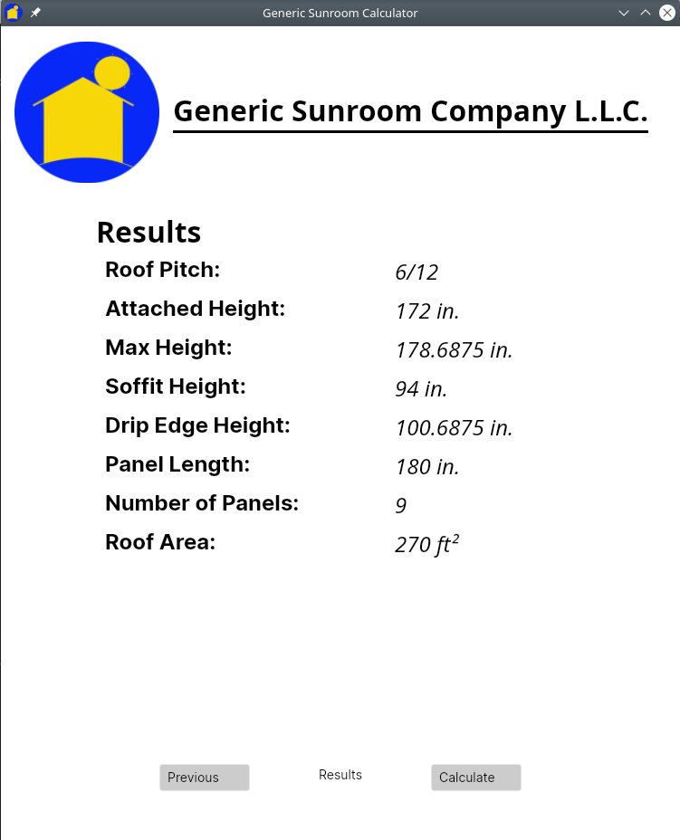

# Sunroom Calculator

## Introduction
The purpose is to calculate several properties of a sunroom with a few given inputs. 
This project was based on my experience with a sunroom designing company that I used to work for. This 
portfolio project was designed to obtain a basic understanding of the MVVM design pattern in C#.
The project is separated into a Library project, Unit Test project for the library, and GUI project.
[Avalonia UI](https://github.com/AvaloniaUI/Avalonia) is used for the GUI since it is cross platform and
WPF is not.

### Technologies

- [.Net](https://dotnet.microsoft.com/download/dotnet-core/3.1) 5.0
- [Avalonia UI](https://avaloniaui.net/) 0.10.0
- [Serilog](https://serilog.net/) 2.10.0
- [Xunit](https://xunit.github.io/) 2.4.1

### Launch:

In the SunroomCalculatorAvalonia directory open a terminal and type the following commands:

```
dotnet restore
dotnet run
```
### Usage

To use this app effectively you must first select a sunroom style. Your choices are between Gable and Studio.
The next screen sill show the scenarios to select from. When designing a sunroom you can be given a variety
of measurements. Wall height, max height, pitch, etc. To simplify this I have narrowed this down to seven 
scenarios that require only two inputs from a specific list of properties. These include: wall height, pitch,
soffit height, attached height (where the bottom of the roof panels attach to the existing structure), 
max height (where the top of the roof panels attach to the existing structure), and drip edge.

The next screen will display the Floor Plan of the sunroom. You only have to enter the dimensions of its layout.
After that is the panel info screen. Here you input the overhang distance, select the panel type, its thickness,
and width. Finally there is the Panel End Cut screen where you select the way the panel will be cut at its ends.

The units of measure are assumed inches (or degrees if you select an angle for the pitch input). This means that
if you were to put in any number without any units the program will assume it is in inches. You can use units
however. The types available are inches and feet. Your inputs can be as follows: `154`,`154 in`, `154"`, 
`12ft - 10in`, or `12'-10"`. The results will be in decimal inches rounded up to the nearest sixteenth.
In order to help the user each scenario and input screen will include diagrams. The following screenshots
are examples.

### Screen Shots








### What was learned?

I got a better understanding of C# and its syntax. I understand the concepts of MVVM, 
[DRY](https://en.wikipedia.org/wiki/Don%27t_repeat_yourself), and 
[SOLID](https://en.wikipedia.org/wiki/SOLID) though I do need more work on the last two. 
The Avalonia UI framework is good but there was not a lot of example and tutorials to use. 
In order to continue to use that framework I will have to practice more with it. 
I also learned a lot about using XAML-based UI frameworks which can be translated over to other 
frameworks such as WPF, .Net MAUI, and Uno Platform.

### What needs work?

Well I should create a menu system (File, Edit, Help, etc) for starters and include the ability to save
and return to previous work. I should put in more logic to check for silly things like negative distances 
because it will still calculate into the void. I also need to work on DRY and SOLID principles because I 
got messy when making the GUI. I also need to figure out how to preserve data between different view models.
I have one single view model that holds all the properties of the many views that I made. I don't know how
to share the data except by using a file like a JSON file. Maybe later.

### License:

This project is licensed under the terms of the [MIT License.](https://gitlab.com/cmcglownjr/livingspace-toolkit-c_sharp/-/blob/master/LICENSE)